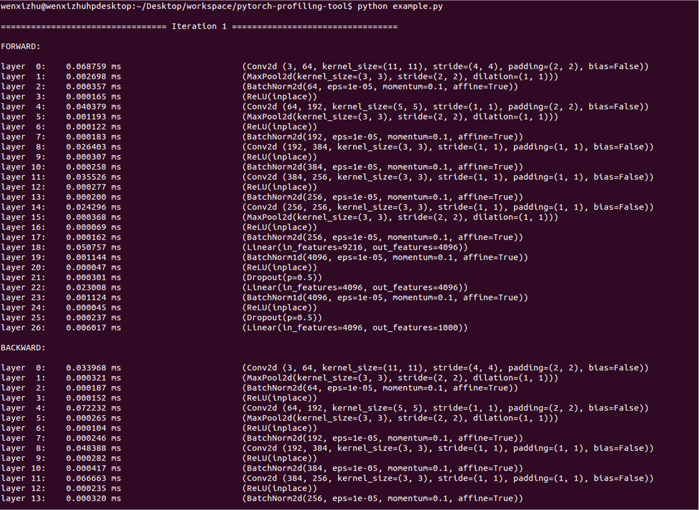

# pytorch-profiling-tool

### Pre-requirements
* To enable this profiling tool, some changes have to be done with exising PyTorch code. You have to manually expose a Python interface "register_pre_hook()" to access backward's pre-hook, for both "THPCppFunction" and "THPFunction". You can reference the implement of "register_hook()" in "python_cpp_function.h" and "python_function.h", they are interfaces for backward's post-hook;
* I understand Pytorch already provides a "register_hook()" interface in "torch.autograd.Variable" to help you access backward's pre-hook, but they don't work properly with inplace elements such as ReLU(inplace). That's why we have to add the "register_pre_hook()" by ourselves.

### Examples: 
The following exampling shows you how to profile the forward/backward layer-by-layer time for Alexnet:

<code>$python example.py</code>

